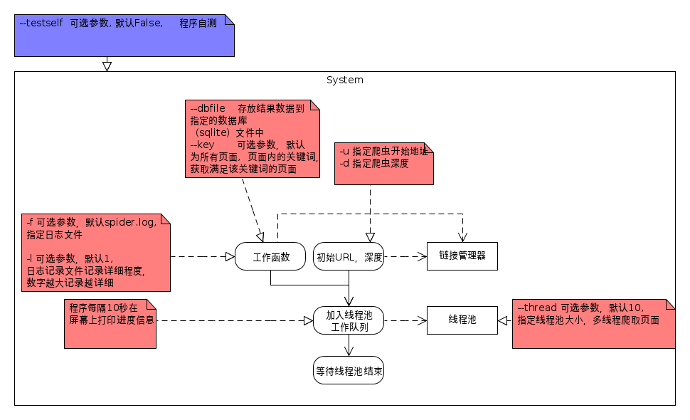
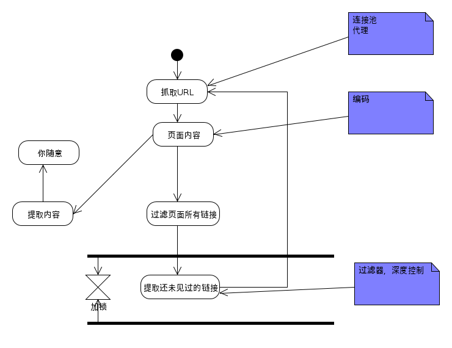
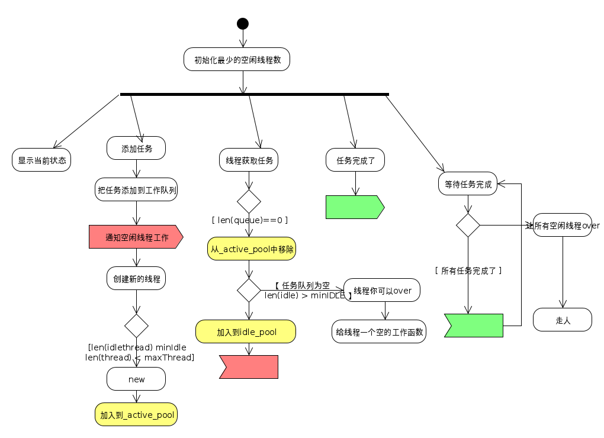

# setup

    pip install -r setup/pip\_install.txt

推荐使用的时候加-B 参数，可以不产生.pyc文件

# 网站爬虫程序
使用python编写一个网站爬虫程序，支持参数如下：

    spider.py -u url -d deep -f logfile -l loglevel(1-5) \
            --testself -thread number --dbfile filepath --key="HTML5"

## 参数说明：
    -u          指定爬虫开始地址
    -d          指定爬虫深度
    --dbfile    存放结果数据到指定的数据库（sqlite）文件中
    --thread    可选参数，默认10,          指定线程池大小，多线程爬取页面,注意由于，同时对一个主机发起太多请求会导致请求被down掉，所以同时设置了一个连接池，连接池数于线程数相同
    --key       可选参数，默认为所有页面,  页面内的关键词，获取满足该关键词的页面
    -f          可选参数，默认spider.log,  指定日志文件
    -l          可选参数，默认1,           日志记录文件记录详细程度，数字越大记录越详细
        1. link, http_status
        2. link, http_status, content_size
        3. link, http_status, content_size, server
        4. link, http_status, content_size, server, last_modified
        5. link, http_status, content_size, server, last_modified, start_time, end_time
    --testself  可选参数, 默认False,     程序自测

## 功能描述：
   1. 指定网站爬取指定深度的页面，将包含指定关键词的页面内容放到sqlite3数据库文件中
   2. 程序每隔10秒在屏幕上打印进度信息
   3. 支持线程池机制，并发爬取页面
   4. 代码需要详尽的注释，自己需要深刻理解该程序所涉及到的各类知识点
   5. 需要自己实现线程池

## 提示：
    1. 使用re urllib/urllib2 beautifulsoup/lxml2 threading optparse Queue sqlite3 logger doctest等模块
    2. 注意是“线程池”而不仅仅是多线程
    3. 爬取sina.com.cn两级深度要能正常结束

### 建议：
程序可分阶段，逐步完成编写，例如：

    版本1： Spider1.py -u url -d deep    
    版本2： Spider2.py -u url -d deep -f logfile -l loglevel(1-5) --testself    
    版本3： Spider3.py -u url -d deep -f logfile -l loglevel(1-5) --testself -thread number     
    版本4： 剩下所有功能

# 整个的逻辑，详情：流程图
概览：

当个页面抓取逻辑：

线程池逻辑：

